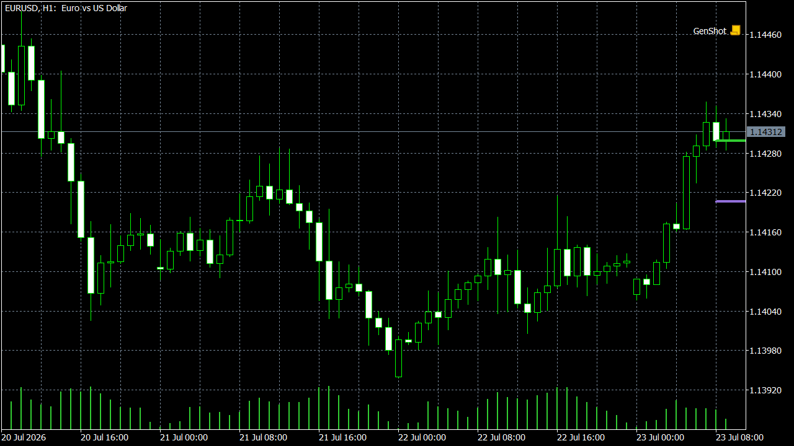

# NeuroVisor

Porte em C++ (DLL) e MQL5 de um indicador de Machine Learning para MetaTrader 5 — uma rede neural feedforward simples que gera previsão de preço e permite visualizar a curva de perda (MSE) durante o treino.

**🇧🇷 Português** · [🇺🇸 English](#english)

## O que é

Este repositório é um porte técnico do indicador Pine "Machine Learning using Neural Networks | Educational", publicado na TradingView por Alien_Algorithms, reimplementado do zero em C++ e MQL5 (nenhuma linha do script original foi reaproveitada — apenas a lógica).

O motor implementa uma rede neural feedforward de 1 camada oculta com 2 neurônios:

- **Forward pass**: multiplicação de matrizes (pesos `w1` entrada→oculta, `w2` oculta→saída) com ativação sigmoide em cada camada.
- **Treino**: a cada barra confirmada, a rede executa `epochs` iterações de backpropagation sobre o preço normalizado/padronizado, ajustando `w1`/`w2` por gradiente descendente com taxa de aprendizado (`Learning Rate`) configurável. Duas variantes de backprop estão disponíveis — simples e verbosa —, replicando as duas funções equivalentes do script original.
- **Inicialização**: pesos aleatorizados a cada treino, com semente para reprodutibilidade dentro do próprio motor. Ressalva declarada: o gerador `math.random(seed)` do Pine não é uma API pública documentada; o porte usa um LCG (linear congruential generator) equivalente em comportamento — convergência e formato da curva de perda batem com o original —, mas os valores absolutos dos pesos iniciais não são reproduzíveis bit a bit contra o script Pine. É uma limitação de plataforma, não do porte.
- **Saída**: a previsão de preço da rede é plotada sobre o preço real; opcionalmente, a curva de MSE ao longo das épocas de treino é plotada em painel separado.

A DLL é stateless: os pesos (`w1`/`w2`) cruzam a fronteira C++↔MQL5 por parâmetro (`double*`, entrada e saída) e vivem em buffer do lado MQL5, por instância de gráfico — o que evita que duas instâncias do indicador (dois gráficos ou símbolos) compartilhem o mesmo estado de treino.

Uso pretendido: estudo da mecânica de uma rede neural (forward pass, backpropagation, gradiente, curva de perda) aplicada a dados de preço — não é um gerador de sinal de entrada/saída pronto para uso.

## Instalação — versão pré-compilada

1. Copie `neural_net.dll` para a pasta `MQL5/Libraries` do seu terminal MetaTrader 5.
2. Copie `TV_04_NeuralNet.ex5` para a pasta `MQL5/Indicators`.
3. Reinicie o MetaTrader 5 (ou, no Navigator, clique com o botão direito em "Indicadores" e atualize a lista).
4. Arraste o indicador `TV_04_NeuralNet` para o gráfico desejado.

## Build a partir do código-fonte

1. Compile o C++ (`neural_net`) com g++/MinGW-w64, usando o `build.sh` incluso em `src/cpp/`. Isso gera `neural_net.dll` (x64).
2. Abra `src/mql5/TV_04_NeuralNet.mq5` no MetaEditor (integrado ao MetaTrader 5).
3. Compile com F7 para gerar o `.ex5`.
4. Copie os artefatos gerados (`neural_net.dll` e `TV_04_NeuralNet.ex5`) para as pastas do terminal conforme os passos de instalação acima.

## Licença

Este repositório é licenciado sob CC-BY-NC-SA-4.0; a lógica original em Pine Script é de autoria de Alien_Algorithms (TradingView), aqui reimplementada do zero em C++ e MQL5.

## Aviso

Uso educacional e de análise técnica. Não constitui recomendação de investimento.

---

## English

C++ (DLL) and MQL5 port of a Machine Learning indicator for MetaTrader 5 — a simple feedforward neural network that produces a price prediction and lets you visualize the loss curve (MSE) during training.

### What it is

This repository is a technical port of the Pine indicator "Machine Learning using Neural Networks | Educational", published on TradingView by Alien_Algorithms, reimplemented from scratch in C++ and MQL5 (no line of the original script was reused — only the logic).

The engine implements a feedforward neural network with 1 hidden layer of 2 neurons:

- **Forward pass**: matrix multiplication (weights `w1` input→hidden, `w2` hidden→output) with a sigmoid activation at each layer.
- **Training**: on every confirmed bar, the network runs `epochs` iterations of backpropagation over the normalized/standardized price, adjusting `w1`/`w2` by gradient descent with a configurable learning rate (`Learning Rate`). Two backprop variants are available — plain and verbose —, replicating the two equivalent functions from the original script.
- **Initialization**: weights are randomized on every training run, with a seed for reproducibility within the engine itself. Declared caveat: Pine's `math.random(seed)` generator is not a publicly documented API; the port uses an LCG (linear congruential generator) that is behaviorally equivalent — convergence and loss-curve shape match the original — but the absolute initial weight values are not bit-for-bit reproducible against the Pine script. This is a platform limitation, not a limitation of the port.
- **Output**: the network's price prediction is plotted over the actual price; optionally, the MSE curve over training epochs is plotted in a separate panel.

The DLL is stateless: the weights (`w1`/`w2`) cross the C++↔MQL5 boundary by parameter (`double*`, in and out) and live in an MQL5-side buffer, per chart instance — which prevents two indicator instances (two charts or symbols) from sharing the same training state.

Intended use: studying the mechanics of a neural network (forward pass, backpropagation, gradient, loss curve) applied to price data — this is not a ready-made entry/exit signal generator.

## Installation — precompiled version

1. Copy `neural_net.dll` into your MetaTrader 5 terminal's `MQL5/Libraries` folder.
2. Copy `TV_04_NeuralNet.ex5` into `MQL5/Indicators`.
3. Restart MetaTrader 5 (or, in the Navigator, right-click "Indicators" and refresh the list).
4. Drag the `TV_04_NeuralNet` indicator onto the chart.

### Build from source

1. Compile the C++ code (`neural_net`) with g++/MinGW-w64, using the `build.sh` script included in `src/cpp/`. This produces `neural_net.dll` (x64).
2. Open `src/mql5/TV_04_NeuralNet.mq5` in MetaEditor (bundled with MetaTrader 5).
3. Compile with F7 to produce the `.ex5`.
4. Copy the generated artifacts (`neural_net.dll` and `TV_04_NeuralNet.ex5`) into the terminal folders per the installation steps above.

### License

This repository is licensed under CC-BY-NC-SA-4.0; the original Pine Script logic was authored by Alien_Algorithms (TradingView), independently reimplemented here in C++ and MQL5.

### Disclaimer

Educational and technical-analysis use only. Not investment advice.
